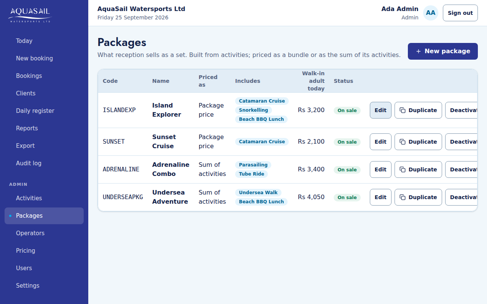
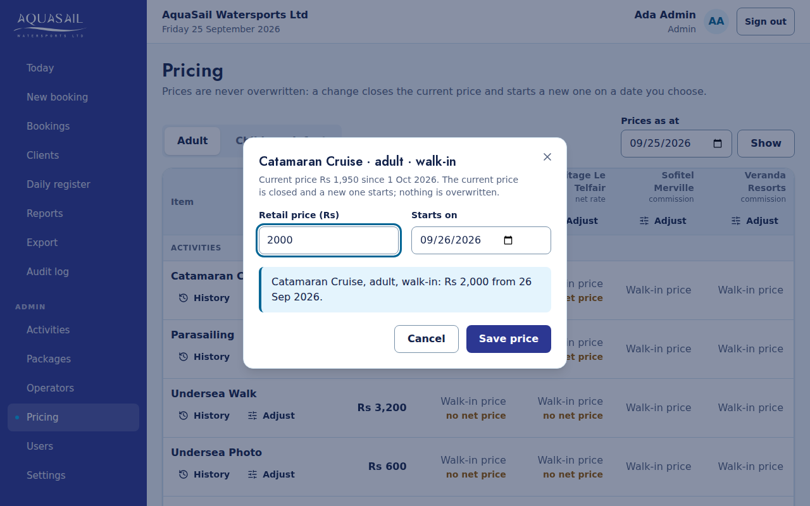
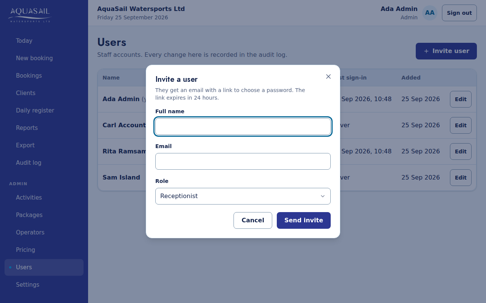
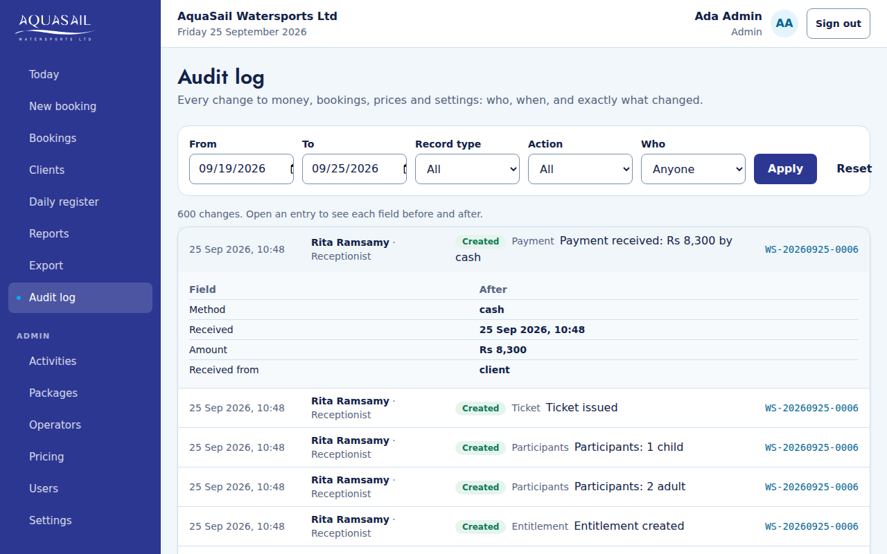

# AquaSail Ops: guide for admins

Admins run the catalogue, prices, operators, users and settings. Every change
is recorded in the **Audit log** with your name. Nothing is ever deleted:
things are deactivated, cancelled or corrected, so history stays readable.

## Adding an activity

**Activities → New activity.** Choose a short **code** (capital letters, e.g.
KAYAK). The code can never be changed afterwards, because prices and exports
refer to it. Give a name, usual duration and whether island staff tick it
off. Then set its prices in **Pricing**: until then reception cannot sell it.

To stop selling something, press **Deactivate**. If it is part of a package
still on sale, you are shown which ones first.

## Building a package

**Packages → New package**, or **Edit** an existing one.

- Add activities from the list, set how many each participant gets, mark any
  as optional, and put them in order.
- **How it is priced**: _One package price_ (you set it in Pricing, like
  Island Explorer) or _Sum of its activities_ (nothing extra to maintain).
- The panel shows what a walk-in adult pays today. A warning appears if a
  price is missing. Saving is still allowed, but reception cannot sell it
  until the price exists.
- **Duplicate** makes an off-sale copy for a seasonal variant.

## Tour operators

**Operators → New operator** asks two separate questions:

1. **How is our price worked out?** _Net rate_ (we charge the operator our net
   price), _Commission_ (the guest pays our price, the operator earns a
   percentage) or _None_.
2. **Who hands us the money?** The customer at reception, or the operator
   later. Choose the second only if the operator really pays AquaSail:
   reception will then see "DO NOT COLLECT PAYMENT" and take nothing.

Get each operator's terms in writing before you enter them.

## Changing a price with an effective date

**Pricing** shows every price for adults, children or infants (tabs). Choose
**Prices as at** to see any past or future date.

1. Click the cell. Type the new price and the date it **starts** (tomorrow
   by default).
2. Read the sentence underneath, e.g. "Catamaran Cruise, adult, walk-in:
   Rs 1,800 until 30 Sep 2026, then Rs 1,950 from 1 Oct 2026." and save.

The old price is kept: bookings already made keep what they were charged.
Prices cannot start in the past.

- **A whole season at once**: the **Adjust** button on a row or column applies
  a percentage (e.g. 5) from a date. Every change is listed for you to check
  before anything is saved.
- **Made a mistake in a future price?** Open the item's **History** and press
  **Withdraw** on the scheduled price (only possible before it starts and if
  no booking uses it).
- Load new seasonal prices a week ahead and check them with **Prices as at**.

## Inviting a user

**Users → Invite user**: name, email and role. They receive an email to choose
a password.

| Role           | For                                                                      |
| -------------- | ------------------------------------------------------------------------ |
| Receptionist   | bookings and payments                                                    |
| Accountant     | reading everything, the audit log and Excel exports                      |
| Activity staff | island ticket scanning (arrives in V2); sees no money or contact details |
| Admin          | everything, including prices, users and settings                         |

When someone leaves, **Edit** their user and choose **Deactivated**. They are
blocked at once. Their name stays on past bookings and in the audit log. You
cannot deactivate yourself, and there is always at least one active admin.

## Reading the audit log

**Audit log** lists every change, newest first, with who made it and when.
Filter by dates, type of record, action or person. Click a line to see each
field before and after. On a booking, **View audit trail** tells that
booking's whole story.

## Settings

**Settings**: company details printed on tickets, the default meeting point,
the ticket footer, the largest discount reception may give, and the logo.

## Excel

**Bookings**: filter (dates, operator, unpaid…) and press **Export to Excel**.
The totals match the screen. **Export** in the menu is a shortcut for a date
range.
