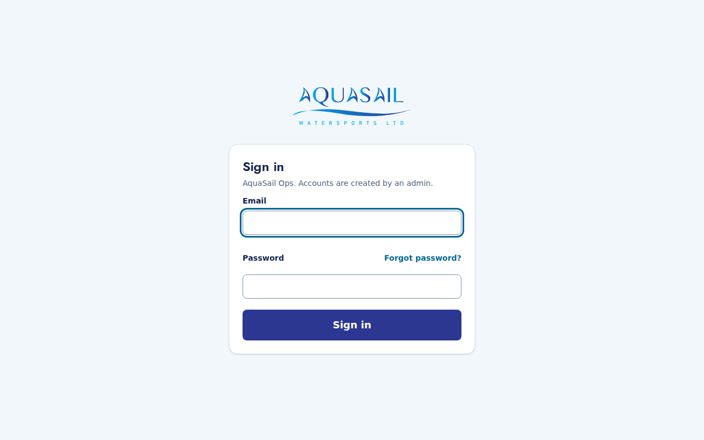
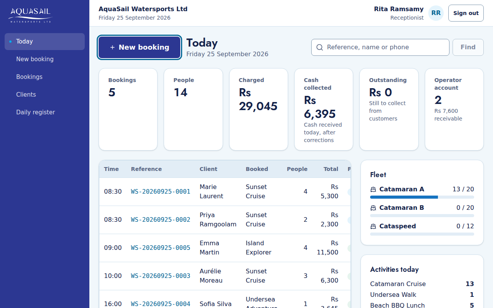
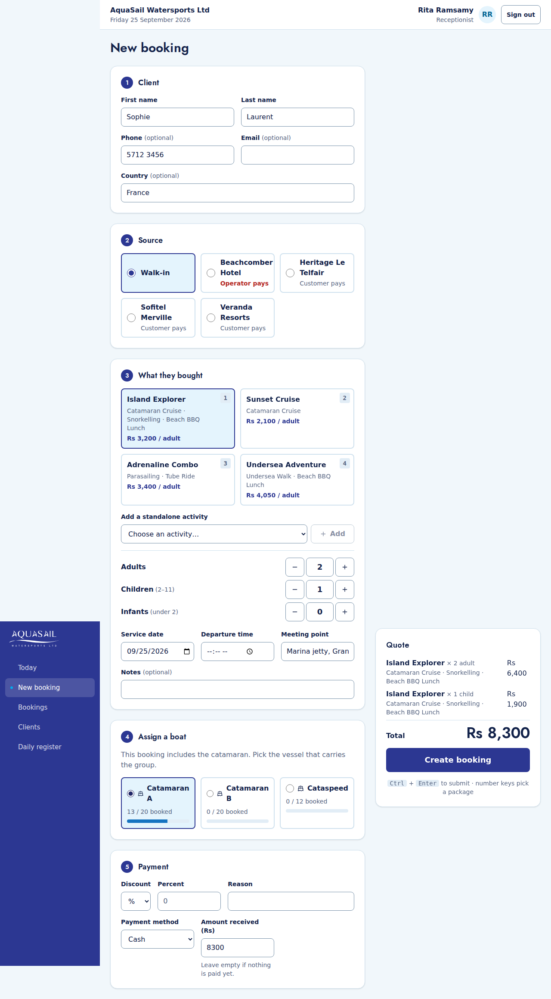
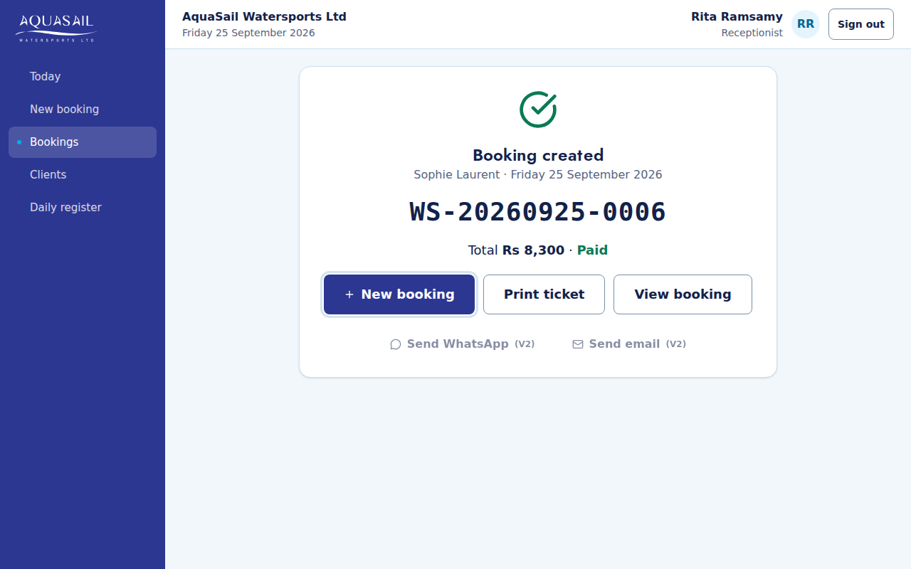
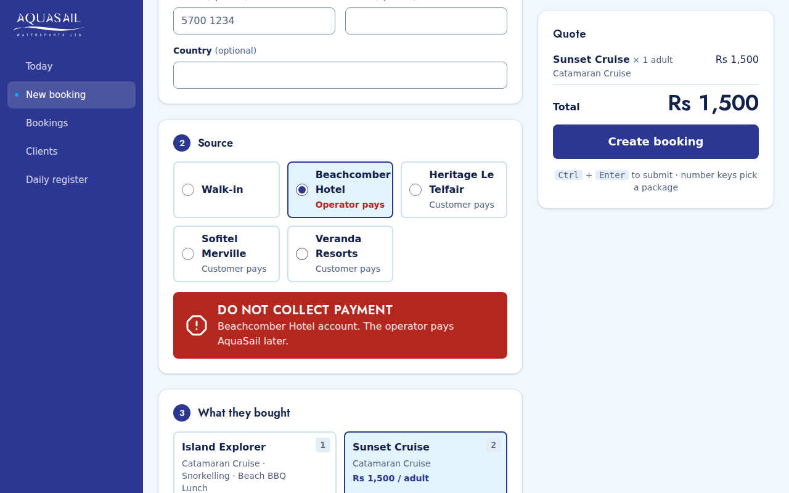
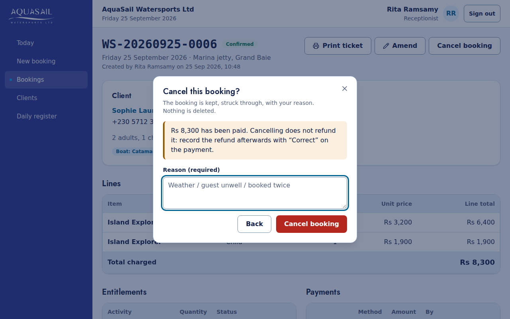
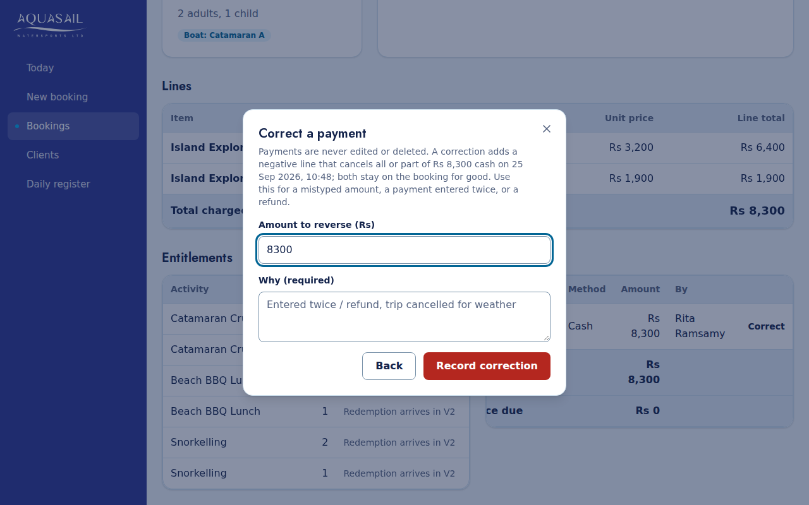
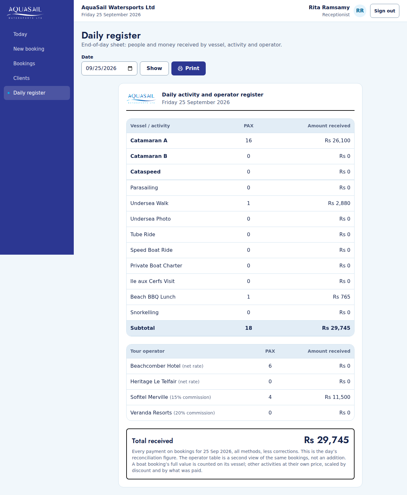

# AquaSail Ops: guide for reception

Everything you need at the desk. Sign in at the address your manager gave
you, with your email and password. Forgot it? Press **Forgot password?** on
the sign-in page.

## Today

Your home screen. **New booking** is already selected: press **Enter** to
start one. The figures are for today only and refresh by themselves every
minute. **Cash collected** is the cash that should be in the drawer. To find
any booking, type its reference (the last digits are enough), the client's
name or phone number into the search box.

## A booking in under a minute

1. **Client.** Type the first name. If the person has booked before, a green
   box says **Existing customer found**: press **Use this client**. Phone and
   email are optional. A Mauritian number needs no +230.
2. **Source.** Walk-in is already chosen. For a hotel or agent guest, pick
   the operator (see "Do not collect" below).
3. **What they bought.** Press **1** to **9** to pick a package (or click it).
   Set the number of adults, children and infants. Add single activities with
   **Add a standalone activity**. Check the date and departure time.
4. **Assign a boat** appears for anything with the catamaran. Pick the boat.
   If it would be over capacity it tells you, but you can still book.
5. **Payment.** The amount received is the total already. For cash, type what
   the customer handed you and the screen shows the **change due**.
6. Press **Ctrl + Enter** (or **Create booking**). You never type a price:
   the system works it out. Pressing twice does not create two bookings.

On the confirmation, press **Print ticket**: the print window opens straight
away. Then **New booking** for the next customer.

## "DO NOT COLLECT PAYMENT"

Some operators pay AquaSail themselves. When you choose one, a red banner
appears and the payment section disappears. **Do not take money from the
guest.** The booking is saved as owed by the operator.

## Discounts

Choose **%** or **Rs**, type the amount and always a **reason**. You can
give up to the limit your manager set (10% unless told otherwise). For more,
ask an admin to make the booking.

## Changing or cancelling a booking

Open the booking (search on Today, or **Bookings**).

- **Amend**: change people, packages, time, meeting point, boat or notes. The
  screen shows "Total was …, now …" and the balance due before you save.
- **Cancel booking**: needs a reason. The booking stays in the system, struck
  through. Cancelling does **not** refund money; see below.
- You can only amend or cancel **today's or future** bookings. For a past
  date, ask an admin. This protects days whose cash has been counted.

## A payment was wrong, or needs refunding

Payments are never edited or deleted. On the booking, press **Correct** next
to the payment, enter the amount to reverse and why ("entered twice",
"refund: trip cancelled"). Both lines stay on the booking for good. To take a
further payment, press **Record payment**.

## When a price is missing

If the screen says "No price configured for Catamaran / child on 17 Sep", the
system will not guess. Tell an admin: they set it in **Pricing**, and you can
book as soon as they have.

## End of the day

Count the drawer against **Cash collected** on **Today**: that is the cash
received today, after corrections. Then open **Daily register**, check the date
and press **Print**. It shows, for that day's trips, the people and money by
boat, activity and operator. Its **Total received** is everything paid for
that day's bookings, so a deposit taken today for next week appears on next
week's sheet, not today's.

## When the internet is down

The system needs the internet. Use the **paper booking sheet** at the desk:
name, phone, what they bought, people, amount and how they paid. When the
connection is back, enter each one with its **real service date**. The system
marks it as a backdated entry, at that date's prices.
